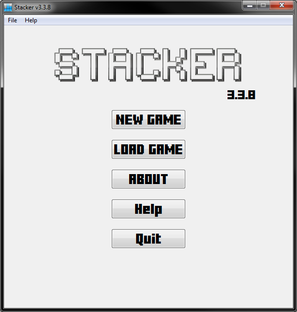
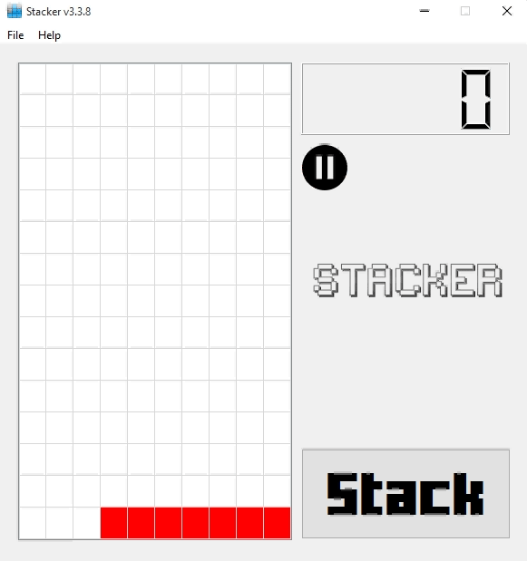

# Stacker
For a school assignment I made a game called: *Stacker*.  
In this game a user needs to move a line of blocks to the top, with the most blocks possible.  
This is not my best work, but the game is still pretty good as a "game".

# Features
* Save game progression
* The spacebar can be used as the *stack* button
* Multiple modes: `Easy`, `Medium`, `Hard`

# Gameplay
  
This gif shows the gameplay of stacker.

# Source
This game was fist made in C and after that it was made in C++.  
For the C source see [this](./stacker_c/) link or the [./stacker_c/](./stacker_c/) directory.  
For the C++ source see [this](./stacker_cpp/) link or the [./stacker_cpp/](./stacker_cpp) directory.  

## Warning
Don't use this software as an example for *how-to program*.  
I know that the quality of the code is not that great. If I'm ever in the mood or have the time to rebuild it, I shall do it.  
When I revise it, I will delete this part. Until then, if you read this I haven't had the time to fix it or you're just looking at an old revision. (If it is the latter, hi future people)

# License
>You can check out the full license [here](LICENSE)

This project is licensed under the terms of the **MIT** license.
